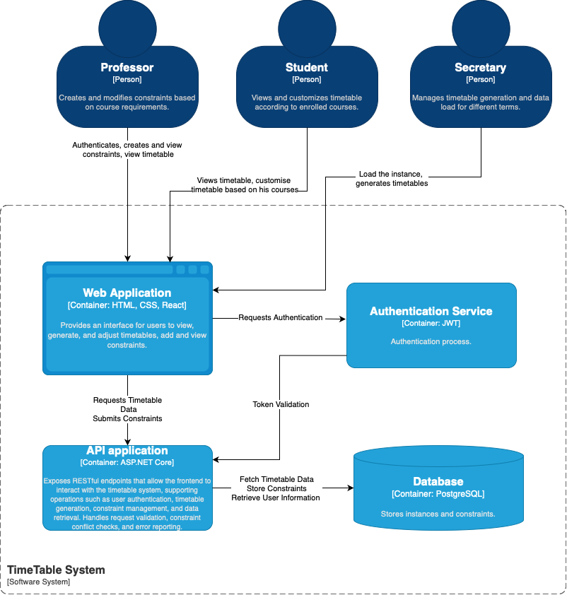

# AI Generated TimeTable Feature Documentation

## 1. Abstract
Our goal is to develop a subscription-based web application that streamlines the scheduling process for educational institutions. The application will provide annual access to AI-generated timetables that accommodate custom constraints entered by professors in natural language. Once the core features are completed, we plan to implement additional enhancements.

---

## 2. Project Levels

### Overview of Levels
The project will be developed in stages to ensure a scalable and efficient system. Each level introduces new features and improvements.

---

### Level 1: Core Features

#### 1.1 Features
- **User Roles and Authentication**:
  - **Admin**:
    - Granted upon purchasing an annual subscription.
    - Perform CRUD operations on groups, rooms, professors, courses, and constraints.
    - Adding a professor generates an account for that professor.
  - **Professor**:
    - Manage (CRUD) constraints that shape the timetable.
    - Constraints are entered in natural language and mapped to predefined categories, such as:
      - `INTERVAL_UNAVAILABILITY`, `CONSECUTIVE_HOURS`, `TIME_CHANGE`, `DAY_CHANGE`, etc.

- **Timetable Generation**:
  - AI generates timetables that respect global constraints and as many professor-specified constraints as possible.

#### 1.2 Technical Implementation
- **Architecture**: Basic client-server model with a database for persistent data storage.
- **Technologies**: ASP.NET Core for the web application, Entity Framework for database operations, and an AI engine for processing constraints.
---

### Level 2: Enhanced Features

- **User Roles and Enhancements**:
  - **Admin**:
    - Import the entire university domain to enable automatic user creation and login using university credentials.
  - **Professor**:
    - Add events related to specific courses (e.g., tests, online sessions with links, cancellations, and rescheduling).
  - **Student**:
    - View their assigned timetable.
    - Mark courses for retakes ("restanta") and receive suggestions for available groups that do not overlap with their existing schedule, with the ability to add the retake to their timetable.
    - Add personal notes to events, which are visible only to the student.

### C4 Model - Level 2

---

## Future Vision: Building a Comprehensive Educational Platform

As we look to the future, our goal is to transform the application into a comprehensive educational management platform. By continuously expanding its features and capabilities, we aspire to provide an all-encompassing solution that meets a wide array of needs for educational institutions. This would reduce the reliance on multiple, fragmented systems and streamline processes into a single, integrated platform.

In this vision, our application could potentially support functions such as, and not limited to:
- **Enhanced Student Management**: Including attendance tracking, grading, and progress reports.
- **Event and Resource Management**: Coordinating campus events, resource reservations, and faculty-student communications.
- **Expanded Communication Tools**: Enabling seamless communication channels between students, professors, and administrators.

Our aspiration is to create a one-stop solution for educational institutions, minimizing complexity and allowing them to operate efficiently through a single, cohesive system.
